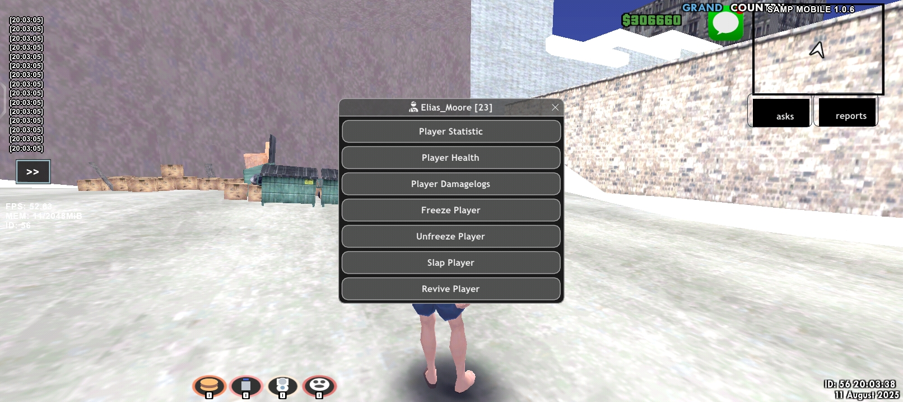

###  adminmenu gta sa-mp cross platform! &nbsp;

Hello! I want to present my project in the form of an adminmenu for administrators, which in this context is the GTA SA-MP admin. 

###  &nbsp; Among them are some of the features below:

- **Languages:** JavaScript/TypeScript, PHP
- **Frameworks & Libraries:** React.js, Next.js, Remix, Svelte, SvelteKit
- **Databases:** MySQL, PostgreSQL, MongoDB
- **Tools:** Git, VSCode, Zed
